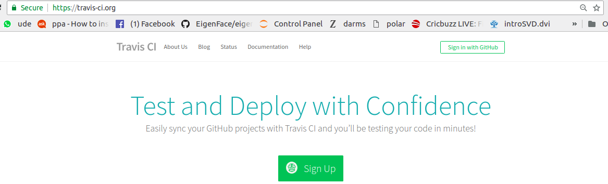

# Continuous Integration With Travis CI

[](https://travis-ci.com/priteshgohil/CI_travis)


## What is Continuous Integration?
* Continuous integration is a software development paradigm in which developers commit their code(s) to their respective branches (or master) recursi
vesly and each pushed commit is verified by an automated build which helps in a deep dive into the problem.

* When there is no CI, it gets hand to debug problems. In majority of cases the individual members are just a part of a bigger team and each team is
developing a sub-part of a bigger project. This causes a lot of problems if there is no validity check at the branch level or repository level.

* Whenever a sub-part of the project is build there are two tests which become essential to determine the functionality of the code:
    * Unit testing - Takes care of individual units (Chuncks of codes with some functionality)
    * Integration testing - Takes care of multiple units communicating with one another.

* In our case we have user travis for CI.

## What is Travis CI and how to make use of it?
* According to wikipedia[1]: https://en.wikipedia.org/wiki/Travis_CI, "Travis CI is a hosted, distributed continuous integration service used to build and test software projects hosted at GitHub." Breaking the definition down, it's a CI service that can be leveraged to verify the codes which are hosted on GitHub. **NOTE**: Travis CI is **NOT** free for private repositories. Since the repository is public, we can use this service for free.

* Basic of travis CI?
    * Head to [https://travis-ci.org/]("https://travis-ci.org/").
    * This should be the landing page: 
    * Select "Sign in with GitHub" on the top right corner and sign in with your account.
    * This will show you list of all your public respository and the repositories shared with you.
    * Select the repository you want to have tests on.

* How to Integrate it with your repository?
    * Once you have an account, head back to your local and to the repository you want tests on.
    * Include a file named ".travis.yaml"
    * These are our contents, the structure of the file remains the same however the contents chages with respect to file names:
    ```
    language: python
    python:
      - "2.6"
      - "2.7"
    branches:
      only:
        - master
        - developer_2 
    script:
      - pytest

    after_success:
      - codecov
    ```
## Test components
* This given code test_area.py has a function that computers area of a rectangle and tests it using pytest.
* The repository is integrated with travisCI which monitors the correctness of the code.
* With each new code, we need to write unittest and pytest will continuously monitor for the changes.
